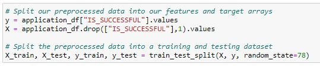
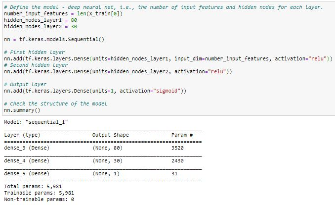

# Neural Network Charity Analysis

## Overview

This analysis uses machine learning and neural networks to create a binary classifier to predict whether or not applicants will be successful if they are funded by Alphabet Soup. The provided dataset has over 34,000 companies and a few features about them and their application. 

## Results

### Data Preprocessing

**What variable(s) are considered the target(s) for your model?**
- The "IS_SUCCESSFUL" feature is my target variable. 

**What variable(s) are considered to be the features for your model?**
- The features for my model are the type of application, company affiliation, classification of application, use case, organization type, application status, income amount, special considerations, and the ask amount.

**What variable(s) are neither targets nor features, and should be removed from the input data?**
- The EIN column containing the tax ID was removed, as well as the company name column. 

### Compiling, Training, and Evaluating the Model

**How many neurons, layers, and activation functions did you select for your neural network model, and why?** 
- I selected 2 layers for my model, and the first hidden layer had 80 neurons. This is because there were 43 input features, and rule of thumb suggests 2-3 times neurons as there are features. The second layer had 30 neurons. My two hidden layers used the relu activation because relu is for positive non linear input data for classification. I used sigmoid on the output layer because it is ideal for binary classification. 

**Were you able to achieve the target model performance?**
- No, the target model performance was 75% accuracy, and my model was 72.62% accurate. 

**What steps did you take to try and increase model performance?**
- The first attempt I made was 1 hidden layer instead of 2, which made the accuracy lower (%72.31).
- My second attempt was training the model for 200 epochs instead of 100 which also decrease accuracay (72.42%).
- My third attempt was using the rmsprop optimizer instead of adam. This also decreased accuracy, but by less (72.59%).
- Lastly, I tried dropping the "Specical Considerations" column because it had very few "Yes" values. This resulted in almost the same accuracy as the original model (72.63)

## Summary

My model had an accuracy of 72.62% in the end, which is not ideal. The loss was 0.5549 which seems to be an acceptable amount. I would suggest using a model that is good at taking in a lot of features. This model may have been improved by adding more layers as well, but it already takes a long time to run. More experimenting could also be done to see if all the features included are necessary. 